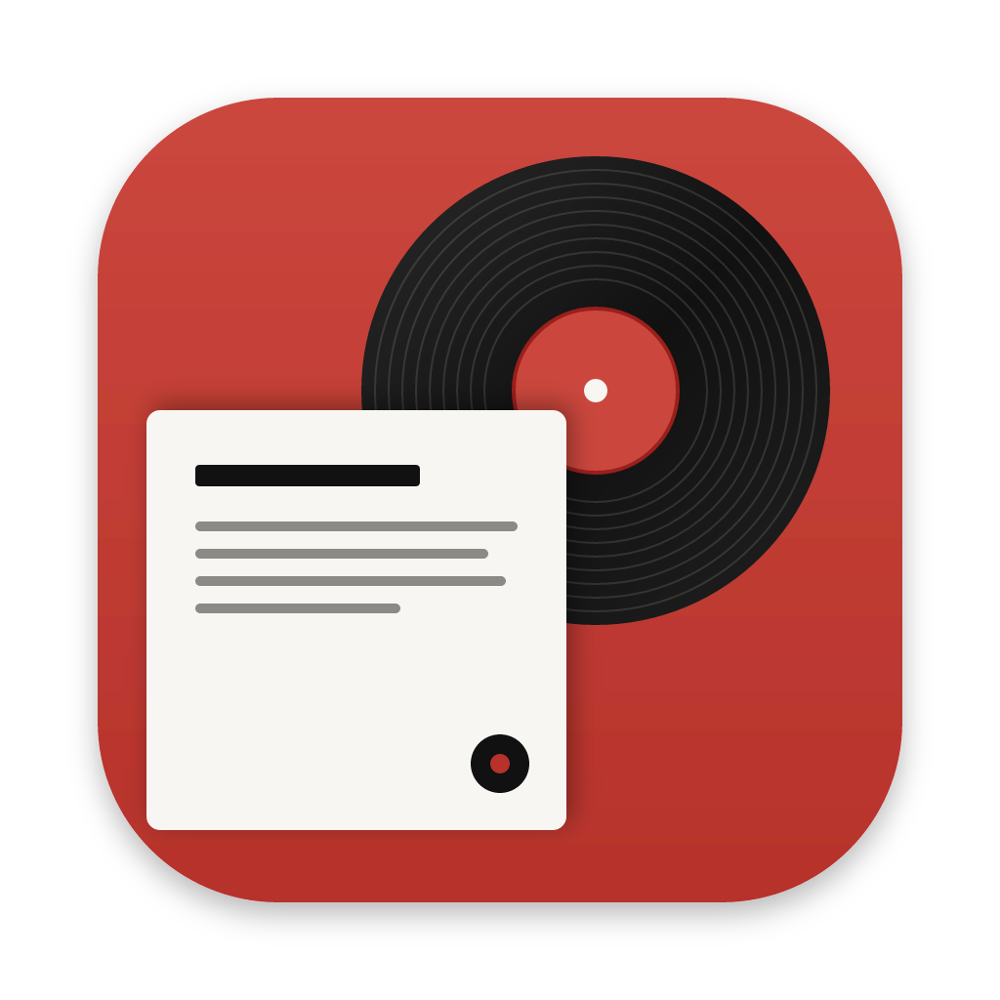
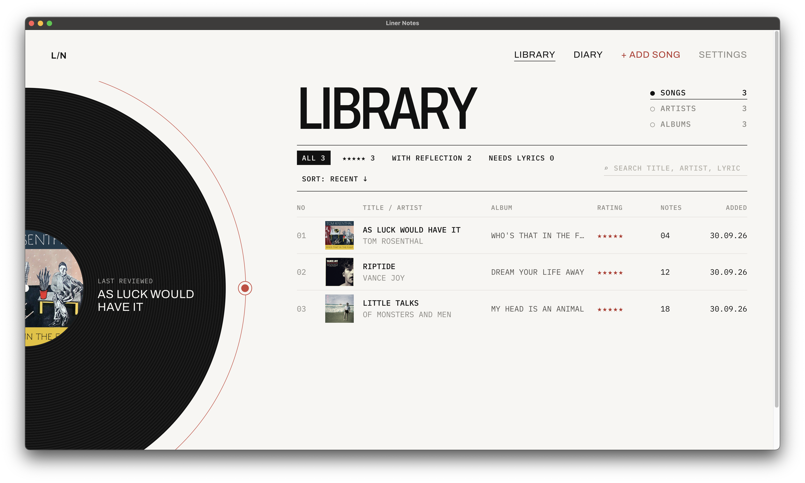
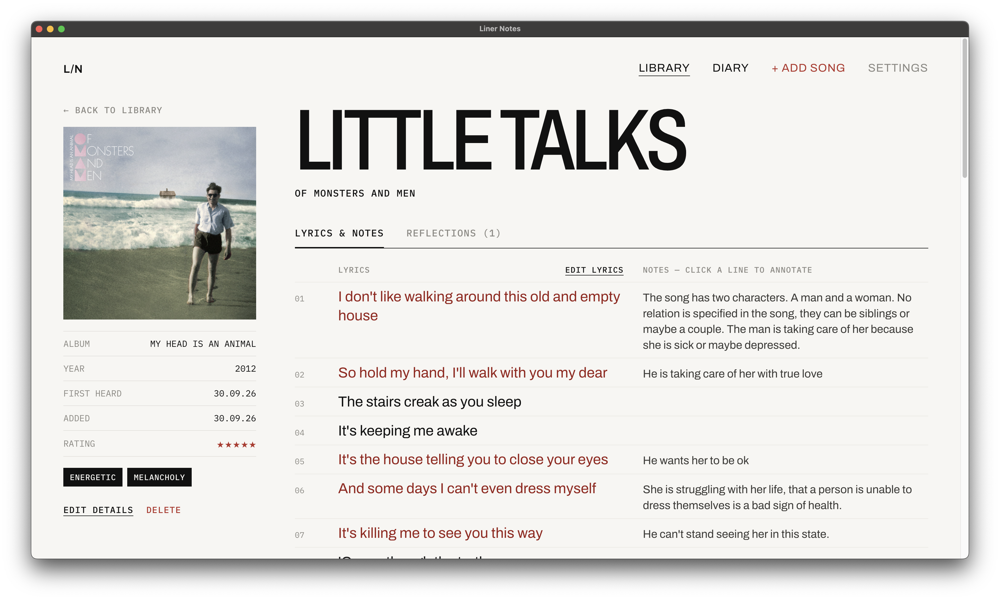
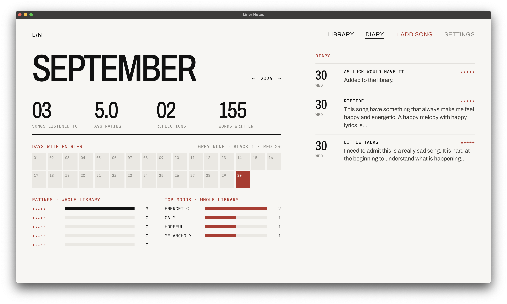

<p align="center">
  
</p>

<h1 align="center">Liner Notes</h1>

A personal song journal that runs on your own computer. Keep a library of songs, annotate lyrics line by line, write dated reflections, and browse a monthly listening diary.

- **Library:** songs, artists and albums, with search, filters and sorting.
- **Song page:** lyrics with per-line notes, rating, moods and details.
- **Reflections:** dated writing about a song, with one-click lyric quotes.
- **Diary:** a monthly calendar of activity, with stats plus rating and mood breakdowns.
- **Spotify lookup (optional):** fill in song, album or artist details, or import a whole album in one go.
- **Light and dark themes.**

Everything is stored in a local SQLite database file. Nothing goes to the cloud. The only outside calls are optional Spotify lookups and Google Fonts.

## Requirements

- [Node.js](https://nodejs.org) **22.13 or newer** (24 LTS recommended). Nothing else is needed. The database is Node's built-in SQLite, so there are no native modules to compile.

## Getting started

```bash
git clone <this repo> liner-notes
cd liner-notes
npm install
npm start
```

Then open **http://localhost:4321**.

On first run the app creates an empty library in `data/linernotes.db`.

## Desktop app

Liner Notes can also be installed as a desktop app (built with [Electron](https://www.electronjs.org)). Installers aren't published, so you build one on your own computer. Each system builds its own installer: build on a Mac for macOS, on Windows for Windows.

```bash
npm install
npm run dist
```

The installer goes in `dist/`:

- **macOS:** open `Liner Notes-<version>-arm64.dmg` and drag **Liner Notes** into Applications. A build you made yourself opens normally. If you copied the `.dmg` from another computer, macOS may say the app is damaged; run `xattr -cr "/Applications/Liner Notes.app"` once to fix it.
- **Windows:** run `Liner Notes Setup <version>.exe`. If SmartScreen warns about an unknown publisher, click **More info**, then **Run anyway**.
- **Linux:** make the `.AppImage` executable (`chmod +x`) and run it.

To try the desktop app without installing it, run `npm run app`.

The desktop app keeps its own library, separate from the browser version's `data/linernotes.db`:

| System  | Database file                                              |
| ------- | ---------------------------------------------------------- |
| macOS   | `~/Library/Application Support/Liner Notes/linernotes.db`  |
| Windows | `%APPDATA%\Liner Notes\linernotes.db`                      |
| Linux   | `~/.config/Liner Notes/linernotes.db`                      |

To move your library from one to the other, quit both and copy the file across.

## Scripts

| Command                    | What it does                                          |
| -------------------------- | ----------------------------------------------------- |
| `npm start`                | Start the app                                         |
| `npm run dev`              | Start and restart automatically when server files change |
| `npm run app`              | Open the desktop app without installing it            |
| `npm run dist`             | Build the desktop installer into `dist/`              |
| `npm run icon`             | Render `build/icon.svg` to the app icon `build/icon.png` |

## Configuration

Optional environment variables:

| Variable  | Default              | Meaning                                                            |
| --------- | -------------------- | ------------------------------------------------------------------ |
| `PORT`    | `4321`               | Port to listen on                                                  |
| `HOST`    | `127.0.0.1`          | Interface to bind. Set `0.0.0.0` to allow other devices on your network |
| `DB_PATH` | `data/linernotes.db` | Where the SQLite database lives                                    |

## Your data

- Everything (songs, lyrics, notes, reflections, album art, settings) is in a single file: `data/linernotes.db` for the browser version (ignored by git), or the file listed under [Desktop app](#desktop-app).
- **Back up:** quit the app and copy that file. **Restore:** put the copy back.
- **Start over:** quit the app and delete the file (plus any `-wal`/`-shm` files next to it). An empty library is created on the next start.
- Album art is stored in the database too, so the file is all you need.

## Spotify (optional)

1. Create an app in the [Spotify developer dashboard](https://developer.spotify.com/dashboard).
2. In Liner Notes, open **Settings**, then paste the app's Client ID and Client secret. Use **Test connection** to check them, then **Save**.
3. On **+ Add song**, search Spotify to fill in the form, or use **Add all** on an album result to import every track.

The credentials are stored in the local database. All Spotify requests go through the local server, never directly from the browser.

## How it's built

A single Node.js process serves both the API and the web app. The desktop app runs that same server inside Electron, on a random local port, and shows it in a window.

```
electron/
  main.js       Desktop app: starts the server, opens the window
build/
  icon.svg      Desktop app icon (source)
  icon.png      Rendered by `npm run icon`; electron-builder makes the .icns/.ico from it
scripts/
  render-icon.js
server/
  index.js      `npm start`: starts the server from environment settings
  server.js     startServer(): database, store and Express app, listening
  app.js        Express app: API, frontend files, error handling
  config.js     Environment variables and paths
  database.js   Schema, connection (node:sqlite) and transactions
  errors.js     HttpError: errors shown to the user
  artInput.js   Album art sent by the client: data URLs, downloads, stored-art URLs
  spotify.js    Spotify client-credentials client
  routes/       REST endpoints under /api (songs and reflections, art, settings, spotify)
  store/        Database access, one file per table, plus input validation
public/
  index.html  Page shell and import map
  app.js      Entry point: mounts <App>
  api.js      Fetch wrapper for the API
  styles.css  Theme tokens and shared utility classes
  components/
    App.js        Top-level state, navigation and actions
    common.css    Styles for the shared components (nav, toast, stars…)
    library/      Library view: song, artist and album lists
    song-form/    Add and edit a song, plus the Spotify search panel
    song-detail/  Song page: lyrics with notes, and reflections
    reflection/   Reflection editor
    diary/        Monthly diary and stats
    settings/     Settings modal
  hooks/      Shared state: songs, settings, toast, system theme
  lib/        Pure helpers: formatting, songs, Spotify results, theme values
```

- **Frontend:** [Preact](https://preactjs.com) with [htm](https://github.com/developit/htm) tagged templates, loaded as native ES modules from `node_modules`. There is no bundler or build step.
- **Styles:** each component folder has its own stylesheet, such as `library/library.css`, using `block__element--modifier` class names. States like `is-active` are modifier classes. Only runtime values (album art images and bar-chart widths) are set inline. New stylesheets must be linked in `index.html` after `styles.css`.
- **Backend:** [Express 5](https://expressjs.com) plus the built-in `node:sqlite`.
- **Tables:** `songs`, `reflections` (cascade-deleted with their song), `art` (image BLOBs, shared by songs from the same album, and pruned once nothing uses them) and `settings`.

## Screenshots

**Library:** songs with album art, ratings and filters.



**Song page:** lyrics with notes on individual lines.



**Diary:** days with entries, stats, and rating and mood breakdowns for the month.


